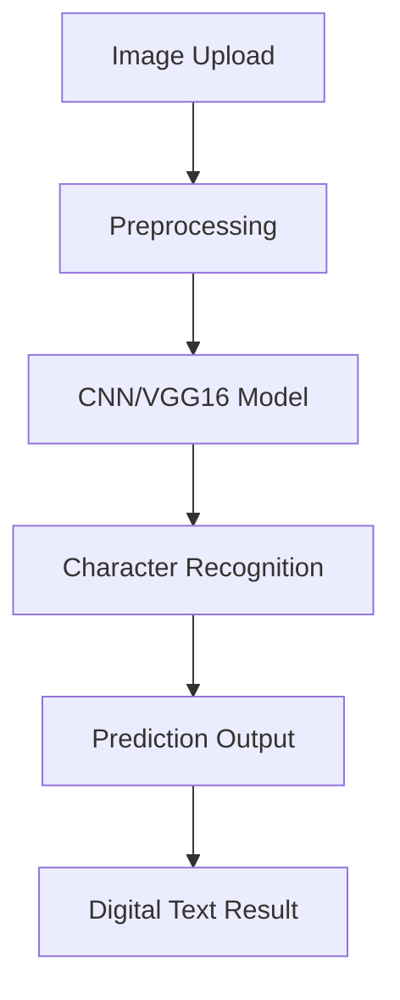

<div align="center">

# 🏛️ Modi Script Character Recognition Using Deep Learning

### 🚀 AI-Powered OCR System for Ancient Modi Script Recognition


</div>

---

# 📖 About The Project

The **Modi Script Character Recognition System** is an AI-powered web application developed to recognize and digitize handwritten characters from the ancient **Modi Script**, historically used for writing Marathi language documents.

This project combines:

- 🧠 Deep Learning
- 👁️ Computer Vision
- 🌐 Flask Web Development
- 📜 Historical Language Preservation

to create an intelligent OCR-based recognition system capable of converting handwritten Modi characters into digital text.

---

# ✨ Features

✅ Handwritten Modi Character Recognition  
✅ CNN/VGG16 Deep Learning Model  
✅ Flask-Based Interactive Web Application  
✅ Real-Time Image Upload & Prediction  
✅ Image Preprocessing using OpenCV  
✅ User Authentication System  
✅ Character Prediction with Confidence Score  
✅ Historical Script Digitization  

---

# 🧠 Deep Learning Architecture

The project uses:

- **Convolutional Neural Networks (CNN)**
- **VGG16 Architecture**
- Feature Extraction Techniques
- Image Normalization & Augmentation

The model was trained on handwritten Modi script datasets collected from:
- Kaggle
- Historical Documents
- Custom Handwritten Samples

---

# 📊 Model Performance

| Metric | Accuracy |
|--------|----------|
| Training Accuracy | 95% |
| Validation Accuracy | 90% |
| Test Accuracy | 90% |

---

# 🛠️ Tech Stack

## 👨‍💻 Programming & Frameworks
- Python
- Flask
- HTML5
- CSS3
- JavaScript

## 🤖 AI / ML Libraries
- TensorFlow
- Keras
- OpenCV
- NumPy
- Pandas
- Scikit-Learn

## 🗄️ Database
- SQLite / MySQL

---

# 🏗️ Project Workflow



---

# 📂 Project Structure

```bash
modi-script-character-recognition/
│
├── dataset/
├── model/
│   └── trained_model.h5
│
├── static/
├── templates/
│
├── screenshots/
├── app.py
├── train_model.py
├── requirements.txt
├── README.md
└── Project_Report.pdf
```

---

# ⚙️ Installation & Setup

## 1️⃣ Clone Repository

```bash
git clone https://github.com/aadarsh0007/modi-script-character-recognition.git
```

## 2️⃣ Move Into Project Directory

```bash
cd modi-script-character-recognition
```

## 3️⃣ Install Dependencies

```bash
pip install -r requirements.txt
```

## 4️⃣ Run Application

```bash
python app.py
```

---

# 🖼️ Application Screenshots

---

## 🔐 Login & Authentication Page

The application provides a secure and user-friendly authentication system where users can log in to access the Modi Script Character Recognition platform.

### Features:
- Secure Login System
- Modern UI Design
- User Authentication
- Responsive Interface

<p align="center">
  
</p>

---

## 🏠 Project Dashboard

The dashboard gives an overview of the project including:
- Domain Information
- Dataset Source
- Deep Learning Algorithm Used
- Framework Details
- Problem Statement
- Proposed Solution

### Dashboard Highlights:
- AI & Machine Learning Domain
- Kaggle Dataset Integration
- CNN-Based Recognition
- Flask Web Framework

<p align="center">
  
</p>

---

## 🔍 Character Prediction & Recognition

Users can upload handwritten Modi script images and the system predicts the character using a trained CNN/VGG16 Deep Learning model.

### Prediction Features:
- Image Upload
- Real-Time Prediction
- Character Recognition
- Confidence Score Display
- Fast Processing

<p align="center">
  
</p>

---

# 🎯 Future Enhancements

🚀 Real-Time Webcam Recognition  
🚀 Mobile Application Development  
🚀 Multi-Language OCR Support  
🚀 Improved Noisy Image Handling  
🚀 Cloud Deployment  

---

# 🌍 Real-World Applications

- 📚 Educational Tools
- 🏛️ Historical Document Preservation
- 🔬 Research & Academia
- 📖 Digital Libraries
- 🧾 OCR Automation Systems

---

# ⭐ Support

If you found this project useful, give it a ⭐ on GitHub!

---

# 📜 License

This project is licensed under the MIT License.
